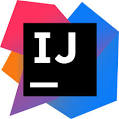
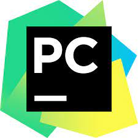
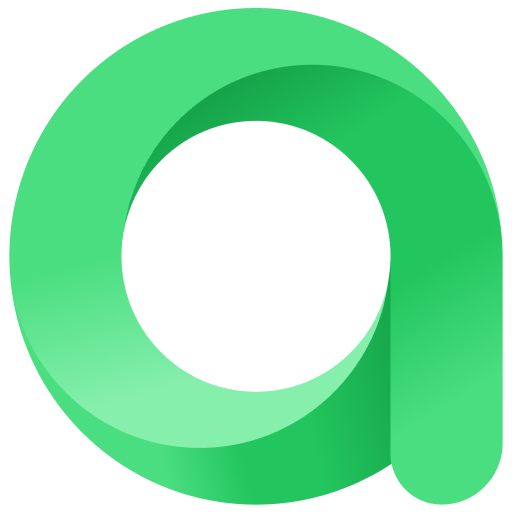
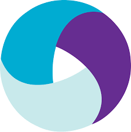

### :gear: My skills
| IDEA | PyCharm | Java | Python | Selenide | Selenoid | Allure Report | Gradle | Junit5 | 
|:--------:|:-------------:|:---------:|:-------:|:----:|:------:|:----:|:----:|:----:|
|  |  |  |  |  |  |  |  |  |  |

| GitHub | Jenkins | Allure TO | Jira | Rest-Assured | Appium | Docker | Browserstack |
|:----:|:------:|:------:|:--------:|:--------:|:--------:|:--------:|:--------:|
| |  |  |  |  |  |  |  |
