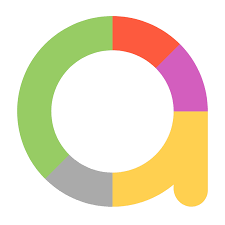

### :gear: My skills
| IDEA | Java | Selenide | Selenoid | Allure Report | Gradle | Junit5 | GitHub |
|:--------:|:-------------:|:---------:|:-------:|:----:|:------:|:----:|:----:|
|  |  |  |  |  |  |  |  |

| Jenkins | Allure TO | Jira | Rest-Assured | Appium | Docker | Browserstack |
|:------:|:------:|:--------:|:--------:|:--------:|:--------:|:--------:|
|  |  |  |  |  |  |  |
